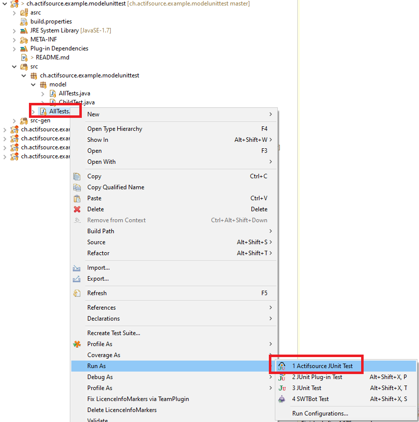
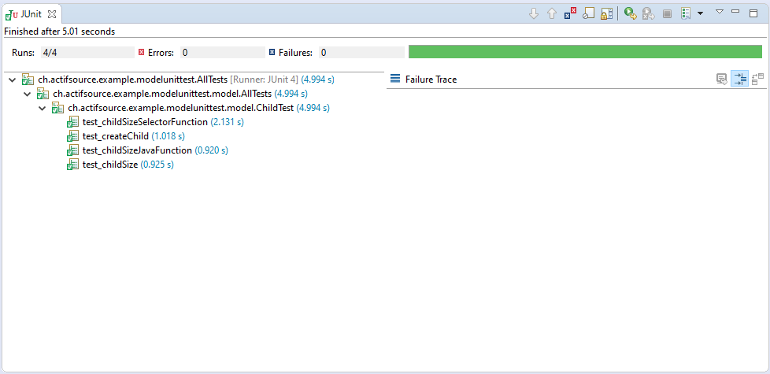

# Model unit test
In this project we will show how to unit test a model.

## Run the unit test  





## Test implementation

```
public class ChildTest extends SingleScopeTestCase {

	public ChildTest() throws IOException {
		super("ch.actifsource.example.modelunittest");
	}

	@Override
	protected void setUp() throws Exception {
		super.setUp();
	}

	/**********************
	 * Start Unit Test
	 *********************/
	
	@Test
	public void test_childSize() {
		assertEquals(5, Select.objectsForRelation(fSession, GenericPackage.Root_child, SpecificPackage.RootInstance).size());
	}
	
	@Test
	public void test_childSizeSelectorFunction() {
		assertEquals(5, TypeSystem.getCompatibleDynamicResourceRepository(fSession).getExtension(IRootFunctions.class, SpecificPackage.RootInstance).getChildsSelector().size());
	}
	
	@Test
	public void test_childSizeJavaFunction() {
		assertEquals(5, TypeSystem.getCompatibleDynamicResourceRepository(fSession).getExtension(IRootFunctions.class, SpecificPackage.RootInstance).getChildsJavaFunction().size());
	
		IRoot root = TypeSystem.getCompatibleDynamicResourceRepository(fSession).getResource(IRoot.class, SpecificPackage.RootInstance);
		assertEquals(5, root.extension(IRootFunctions.class).getChildsJavaFunction().size());
		assertEquals(5, RootFunctionsImpl.INSTANCE.getChildsJavaFunction(root).size());	
	}
}
```

## Requirements
Actifsource  Workbench Community Edition

## License
[http://www.actifsource.com/company/license](http://www.actifsource.com/company/license)